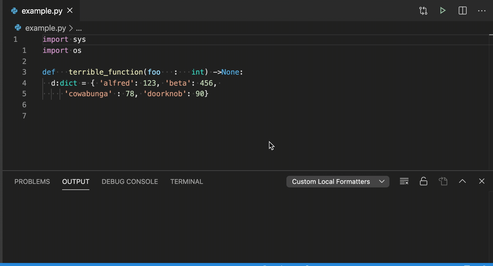

# VSCode Custom Local Formatters

Lets users add formatters to VSCode that run locally defined scripts.

## Motivation

VSCode's formatter features lets you quickly format code through the Format Document command (`shift+alt+f`)
or automatically on save with the `editor.formatOnSave` option.

However, the only way to add new formatters to VSCode is by installing an extension.
If you have custom formatting tools or scripts you want to run, there's no easy way to integrate them with VSCode currently.

This extension solves that problem by providing an easy way to register custom scripts as VSCode formatters.
Here's an example of a custom python script that sorts imports and reformats code being run on a python file:




## Quickstart
0. Install this extension through the VSCode extensions panel or [VSCode extensions marketplace](https://marketplace.visualstudio.com/items?itemName=jkillian.custom-local-formatters).

1. Define your custom formatting script.
   Scripts will receive the contents of the file to be formatted over STDIN.
   They should output the formatted results over STDOUT.
  
2. Configure the extension to run your script on files of the right type.
   The script will be run with a working directory of the workspace root.
   Valid language identifiers [can be found here](https://code.visualstudio.com/docs/languages/identifiers).

   ```json
     "customLocalFormatters.formatters": [
       {
         "command": "python format-yml-files.py",
         "languages": ["yml"]
       }
     ]
   ```

3. That's it! Your script is now integrated with VSCode as an official formatter.
   You can now format your code though the Format Document command (`shift+alt+f`), enable the `editor.formatOnSave` option, or use the formatter however else VSCode allows.

## Extension Settings

Basic usage is just to set a command and an array of languages it should apply to:

```json
  "customLocalFormatters.formatters": [
    {
      "command": "python format-yml-files.py",
      "languages": ["yml"]
    }
  ]
```

You can also specify platform-specific commands instead if needed:

```json
  "customLocalFormatters.formatters": [
    {
      "command": {
        "darwin": "gshuf",
        "*": "shuf"
      },
      "languages": ["yml"]
    }
  ]
```

Full extension configuration schema and documentation can be found in the [`package.json`](package.json) file.

## Known Limitations

VSCode doesn't seem to provide a way to name the formatter which an extension creates.
This means that if you register multiple formatters for the same language,
they will unfortunately both show up as 'Custom Local Formatters' and it will be difficult to tell them apart.
